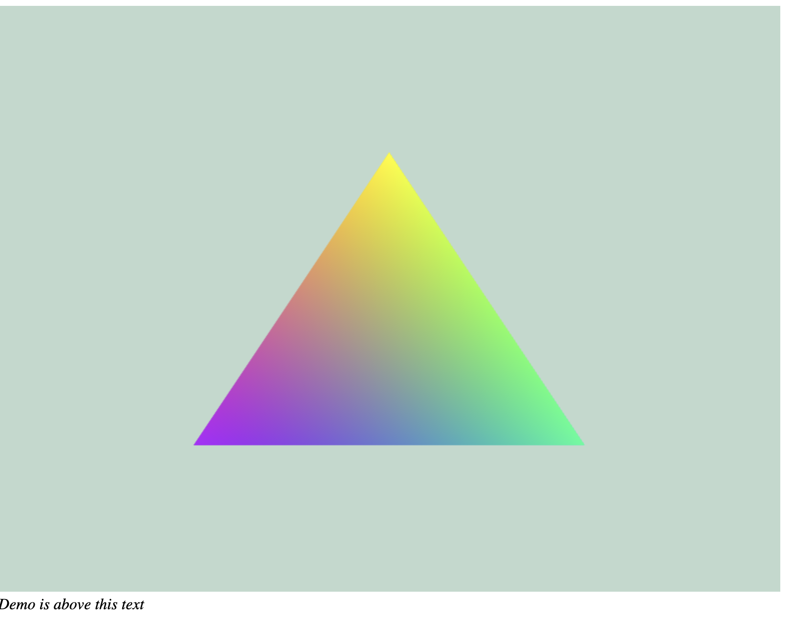

# First webgl That creates a 2D triangle with colors
-----

*fill this later*

This triangle is made in webgl

### To run the app:

- clone the repo and run `cd learn-webgl/introgl`
- open the `index.html` with your browser